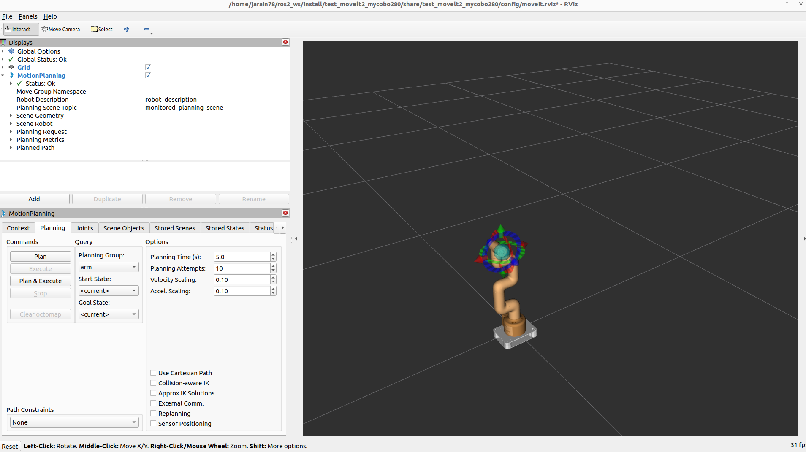

# mycobot280_movelt2

# Introduction to the MyCobot280 MoveIt2 Repository

The MyCobot280 MoveIt2 repository is an exciting platform that combines the power of the MyCobot280 M5 robot from Elephant Robotics with the advanced motion planning system MoveIt2. This fusion creates a robust and flexible development environment for robotics research, education, and practical application.

## Key Features:

1. **Integration of MyCobot280 M5:** The repository enables seamless integration of the MyCobot280 M5, a compact collaborative robot with five degrees of freedom and a wide range of applications.

2. **MoveIt2 Motion Planning System:** Utilizing MoveIt2, users can easily and accurately plan, simulate, and execute complex movements of the MyCobot280.

3. **Versatile Programming:** The repository provides tools and examples for programming the MyCobot280 using different languages and environments, making it accessible to users of all skill levels.

4. **Educational and Research Applications:** From teaching robotics concepts to conducting research in motion planning and control, the MyCobot280 MoveIt2 repository offers a rich and versatile environment for a wide range of applications.

